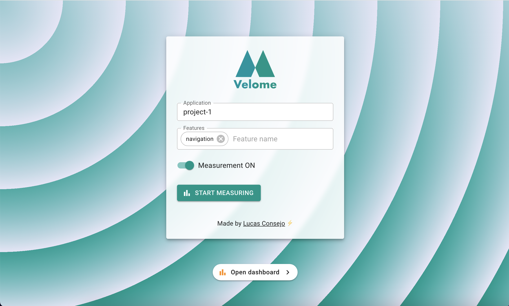
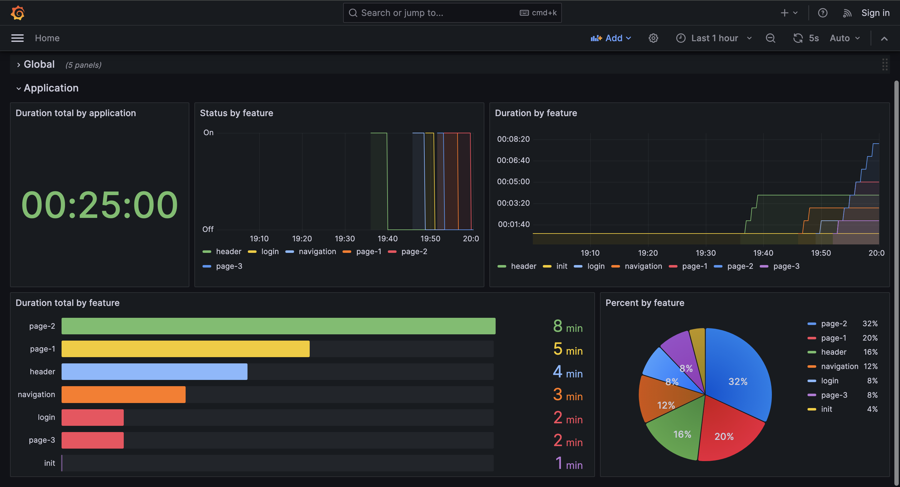

<div align="center">
  
  <p align="center">App to measure your velocity in developing applications.</p>
</div>

<details>
  <summary>Table of Contents</summary>
  <ol>
    <li><a href="#velome">Velome</a>
    </li>
    <li>
      <a href="#getting-started">Getting Started</a>
      <ul>
        <li><a href="#requirements">Requirements</a></li>
        <li><a href="#setup">Setup</a></li>
      </ul>
    </li>
    <li><a href="#technologies">Technologies</a>
    </li>
  </ol>
</details>

# Velome

Velome allows you to measure your velocity when you develop applications.



You can measure the overall time of all applications

Also, measure by application and by features


## Getting Started

### Requirements

To use Velome, you must install docker with docker-compose on your machine.

### Setup

1. Clone this repo

```sh
git clone https://github.com/lucasconsejo/Velome.git
```

2. Start

```sh
docker-compose up -d --build
```

Then Velome is accessible via urls:

- Application: http://localhost:3000
- Grafana dashboard: http://localhost:4000
  > You can change the ports from docker-compose.yml.

## Technologies

- [React.js](https://react.dev/)
- [Vite.js](https://vitejs.dev/)
- [Express.js](https://expressjs.com/)
- [Mui (Material-ui)](https://mui.com/)
- [Grafana](https://grafana.com/)
- [Prometheus](https://prometheus.io/)
- [Docker](https://www.docker.com/get-started/)
- [Docker Compose](https://docs.docker.com/compose/)

Made by Lucas Consejo ⚡
