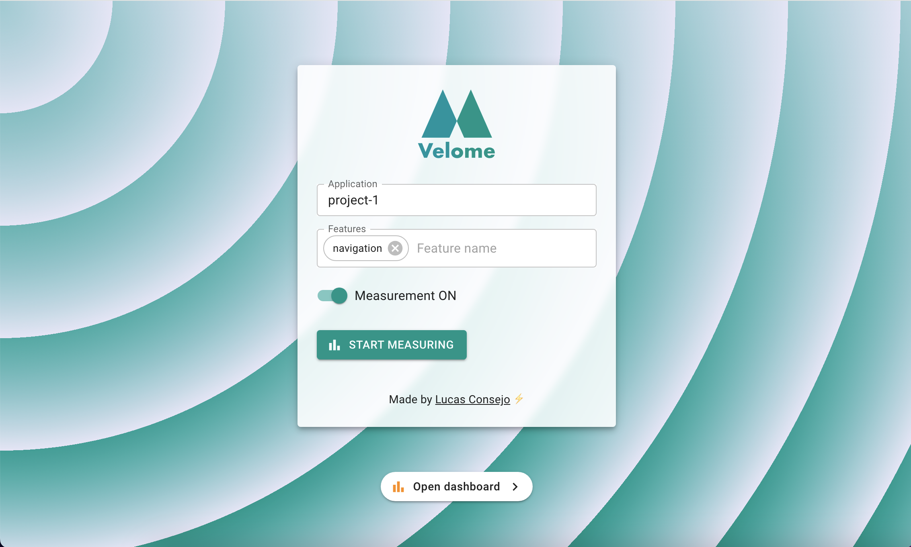

<div align="center">
  
  <p align="center">App to measure your velocity in developing applications.</p>
</div>

<details>
  <summary>Table of Contents</summary>
  <ol>
    <li><a href="#velome-app">Velome app</a>
    </li>
    <li>
      <a href="#getting-started">Getting Started</a>
      <ul>
        <li><a href="#requirements">Requirements</a></li>
        <li><a href="#setup">Setup</a>
          <ul>
            <li><a href="#install">Install</a></li>
            <li><a href="#environment-variables">Environment variables</a></li>
          </ul>
        </li>
      </ul>
    </li>
    <li><a href="#start">Start</a>
    </li>
    <li><a href="#build">Build</a>
    </li>
    <li>
      <a href="#commands">Commands</a>
      <ul>
        <li><a href="#eslint">ESLint</a></li>
        <li><a href="#preview">Preview</a></li>
      </ul>
    </li>
  </ol>
</details>

# Velome app

Velome app is developed with [React.js](https://react.dev/) using [Vite.js](https://vitejs.dev/) and [Mui (Material-ui)](https://mui.com/).



## Getting Started

### Requirements

You must install NodeJS, NPM, Yarn on your machine.

> I prefer to use yarn rather than npm.

### Setup

#### Install

```sh
yarn install
```

#### Environment variables

```sh
VITE_API_BASE_URL: http://localhost:8080 # Velome api url
VITE_DASHBOARD_URL: http://localhost:4000 # Grafana url
```

## Start

Start app locally

```
yarn dev
```

Then Velome app is accessible via url: http://localhost:5173

## Build

_Command for production environment_

```
yarn build
```

## Commands

### ESLint

```
yarn lint
```

### Preview

```
yarn preview
```

Made by Lucas Consejo ⚡
